# CRUD com Tkinter, Psycopg2 e PostgreSQL

Este é um projeto de sistema CRUD (Create, Read, Update, Delete) desenvolvido em Python, utilizando a biblioteca Tkinter para a interface gráfica e a psycopg2 para ser o conector entre aplicação e o PostgreSQL como banco de dados. O objetivo do projeto é exercitar e consolidar conhecimentos na linguagem Python, manipulação de banco de dados e desenvolvimento de interfaces gráficas.

## Tecnologias Utilizadas

- **Linguagem:** Python

- **Interface Gráfica:** Tkinter

- **Banco de Dados:** PostgreSQL

- **Bibliotecas auxiliares:** psycopg2, tkinter.
  
- **Modulo:** VENV (Maquina virtual python)

## Funcionalidades

- Adicionar registros ao banco de dados

- Listar registros em uma interface amigável

- Atualizar informações de registros existentes

- Remover registros do banco de dados

## Como Executar o Projeto

### 1. Clonar o Repositório

```
git clone https://github.com/seuusuario/nome-do-repositorio.git
cd nome-do-repositorio
```

### 2. Criar e Ativar um Ambiente Virtual (Opcional, mas recomendado)
```
python -m venv venv
source venv/bin/activate  # No Windows: venv\Scripts\activate
```

### 3. Instalar Dependências
```
pip install -r requirements.txt
```
### 4. Configurar o Banco de Dados

Certifique-se de que o PostgreSQL está instalado e rodando.

Crie um banco de dados e atualize as credenciais no arquivo de configuração.

Execute o script SQL de criação das tabelas **bancoDeDadosPostgree.py** alterando a linha que envolve as credenciais do banco.
```python
pg2.connect(database="SUA_BASE_DADOS", user="USUARIO_BANCO_DADOS", password="SUA_SENHA", host="127.0.0.1", port="5432")
```

### 5. Executar o Projeto

 python main.py

### Estrutura do Projeto

```mermaid
flowchart TD
    subgraph root
        dir1[projeto_crud/]
        file1[**Arquivo principal**
        main.py]
        file2[**Conexão e operações no banco de dados**
        crud_db.py]
        file3[**Dependências do projeto**
        requirements.txt ]
        file4[**Documentação do projeto**
        README.md]
       file5[**Criador de tabela no banco** bancoDeDadosPostgree.py]
    end
    
    dir1 --> file1
    dir1 --> file2
    dir1 --> file3
    dir1 --> file4
    dir1 --> file5
    root --> dir1
```



### Contribuição

Sinta-se à vontade para contribuir com melhorias, correções ou novas funcionalidades. Basta seguir os passos:

#### Fork o repositório

Crie um branch para suas alterações (git checkout -b minha-feature)

Commit suas mudanças (git commit -m 'Minha nova feature')

Push para o branch (git push origin minha-feature)

Abra um Pull Request

### Licença

Este projeto está licenciado sob a MIT License.

**Desenvolvido** por Zander de Jesus Lopes 🚀
